# 𝙷𝚎𝚕𝚕𝚘, 𝙵𝚛𝚒𝚎𝚗𝚍𝚜! 

#### I'm a Web Dev and Cyber Security Enthusiast live in Indonesia.

- 🙎🏻‍♂️ I’m a College Student
- 🤷🏻‍♂️ Pronouns He/Him
- ☕ Currently ~~learning about Go and backend stuff~~ trying to comeback with Laravel 
- 👨‍💻 CTF is Fum!

   

 
### 𝙷𝚒𝚐𝚑𝚕𝚒𝚐𝚑𝚝𝚜
- [Go Rest Boilerplate](https://github.com/snykk/go-rest-boilerplate) | My template as a starting point for building RESTful APIs in Go
- [Golib Backend](https://github.com/snykk/golib-backend) | Clean Architecture implementation in Go
- [Kanban App](https://github.com/snykk/kanban-app) | A Kanban app built with Go & mux
- [Ayummy](https://github.com/snykk/ayummy) | Mobile app build with Flutter
- [Laracoffee](https://github.com/snykk/laracoffee) | An E Commerce website for coffee shop, developed using Laravel 9 and Bootstrap CSS
- [X Sinema](https://github.com/snykk/x_sinema) | An E Commerce website built with ASP.NET Core MVC and Bootstrap CSS
 
#### 𝙾𝚙𝚎𝚛𝚊𝚝𝚒𝚗𝚐 𝚂𝚢𝚜𝚝𝚎𝚖

#### 𝙷𝚘𝚠 𝚝𝚘 𝚁𝚎𝚊𝚌𝚑 𝙼𝚎

<a href="https://www.linkedin.com/in/moh-najib-fikri/"><image src="https://img.shields.io/badge/LinkedIn-%230059ef.svg?style=flat&logo=linkedin&logoColor=white">
</a>
<a href="https://www.instagram.com/_najibfikri/"><image src="https://img.shields.io/badge/Instagram-%23df05a7.svg?style=flat&logo=instagram&logoColor=white">
</a>
<a href="mailto:najibfikri13@gmail.com"><image src="https://img.shields.io/badge/Gmail-%2339c7f3.svg?style=flat&logo=gmail&logoColor=white">
</a>
<a href="https://t.me/itsme_snykk"><image src="https://img.shields.io/badge/Telegram-%2339c7f3.svg?style=flat&logo=telegram&logoColor=white">
</a>
<a href="https://discordapp.com/users/998541525317332994"><image src="https://img.shields.io/badge/Discord-%235662f6.svg?style=flat&logo=discord&logoColor=white">
</a>

#### 𝙷𝚊𝚟𝚎 𝙻𝚎𝚊𝚛𝚗𝚎𝚍 

### 𝙻𝚊𝚝𝚎𝚜𝚝 𝙶𝚒𝚝𝙷𝚞𝚋 𝙼𝚎𝚝𝚛𝚒𝚌𝚜 

